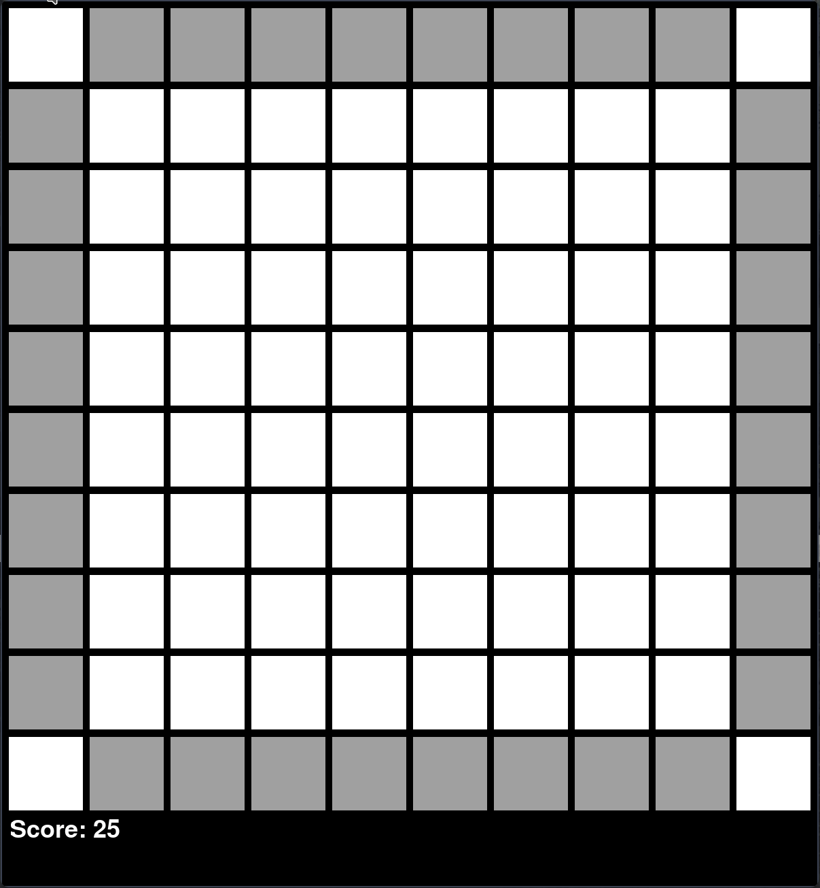

# Black Box - An Approximation Of The Board Game "Black Box"

This program written in Python using Pygame for interactivity allows you to play the "abstract board game" Black Box.
The game [described here](https://en.wikipedia.org/wiki/Black_Box_(game)) is a 2D (roughly) physics based 
guessing game in which the player guesses the position of "Atoms" within the box based on the reflection of "Rays"
shot from corner squares. The game implements all rules mentioned in the wikipedia article above but differs in some respects to make it more playable as a computer game. For example, the player only starts with 25 points. 

To play launch Main.py which will ask you to enter the number of atoms you wish to play with. The game 
will then place the atoms randomly throughout the board and draw it to begin play.
